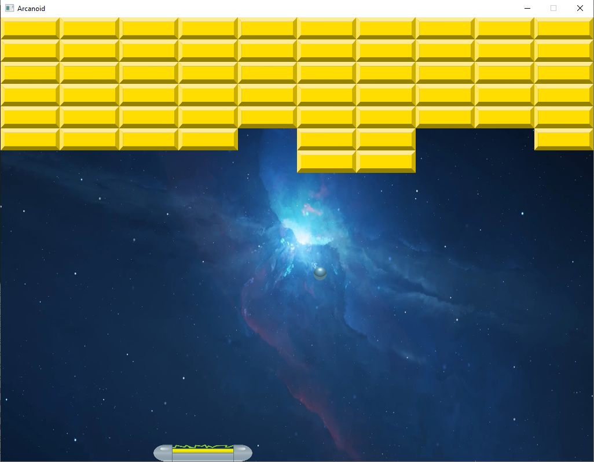
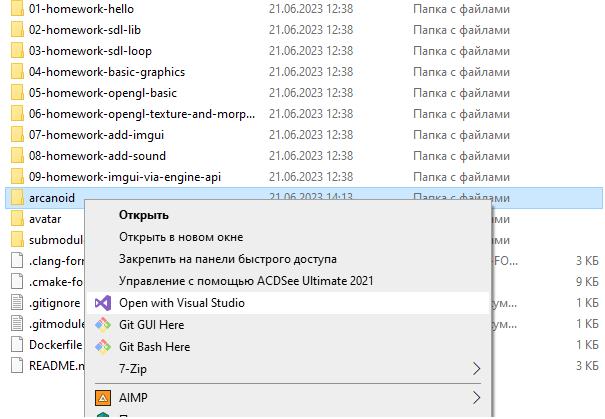
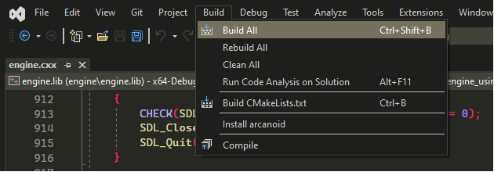
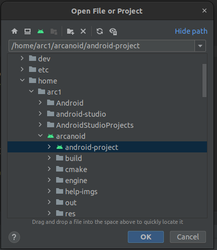

# Arcanoid game

Build Platform            |
--------------------------|
Linux x64(gcc, clang)     |
Windows x64(MSVC, LLVM)   |
Android (API Level >= 21) |

 Stack                                      |
--------------------------------------------|
SDL3, OpenGL ES 3.2, c++17, ImGui, glm, fmt |


This project was written basing on the work stuff from [`LestaGamesCourse`](https://github.com/ArthurBandaryk/LestaGamesCourse) repository.



## Build steps for Linux

1. Run the following sets of commands in terminal:

```
git clone --recurse-submodules https://github.com/ArthurBandaryk/arcanoid.git
cd arcanoid
cmake -B build -G "Ninja" -S .
cmake --build build

```

2. To run the game just do the following:

```
cd build && ./arcanoid

```

## Build steps for Windows

### Using LLVM compiler infrastructure

1. First of all make sure you have installed llvm. Use [`this`](https://github.com/llvm/llvm-project/releases/tag/llvmorg-15.0.7) link to download exe needed.

2. You may also need for [`ninja`](https://github.com/ninja-build/ninja/releases).
3.  And of course [`cmake`](https://cmake.org/download/#latest).

4. Run the following set of commands to build project:

```
git clone --recurse-submodules https://github.com/ArthurBandaryk/arcanoid.git
cd arcanoid
cmake -B build -G "Ninja" -S .
cmake --build build

```

5. To `run` this game just do the following:

```
cd build && arcanoid.exe

```

### Using MSVC

1. First of all clone [`this`](https://github.com/ArthurBandaryk/arcanoid.git) repo:

```
git clone --recurse-submodules https://github.com/ArthurBandaryk/arcanoid.git

```

2. Then you can open arcanoid folder with Microsoft Visual Studio:



3. Set the workspace root to `arcanoid/CMakeLists.txt` file. 

4. After that you should press `CTRL + S` on the root `CMakeLists.txt` (arcanoid/CMakeLists.txt) to generate build files.

5. Then just press `Build` button:



6. Then click `Run` button and enjoy it:)

## Build steps for Android using Android Studio

1. Make sure you have installed [`Android Studio`](https://developer.android.com/studio).

2. Upgrade your SDK if you have version less than `33`.

3. Upgrade NDK if the version is less than `25.2.9519653`.

4. Clone [`arcanoid`](https://github.com/ArthurBandaryk/arcanoid.git) repo:

```
git clone --recurse-submodules https://github.com/ArthurBandaryk/arcanoid.git

```

5. Open `android-project` folder in your Android Studio (android/android-project):



6. Press `Build` button or `CTRL + F9` to start building process.

7. Then just connect your android device to `Android Studio`, make sure that you've turned on `developer settings` and `debugging via usb` on your android machine.

8. Click run button and enjoy it.
